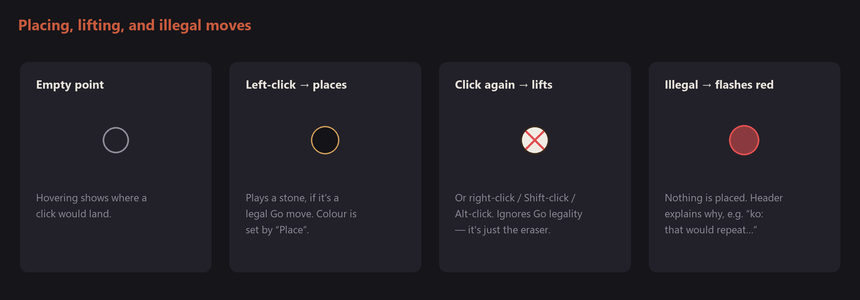
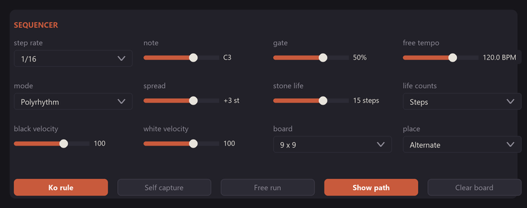
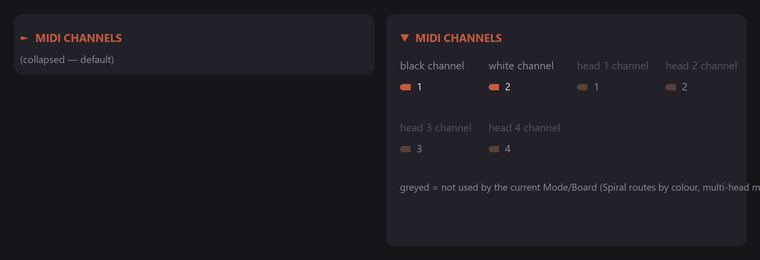
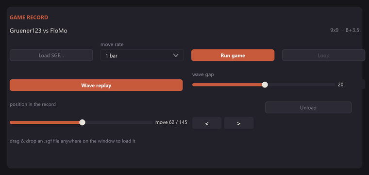
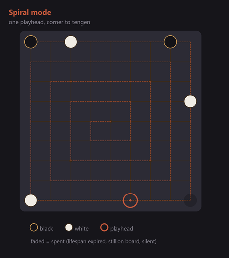
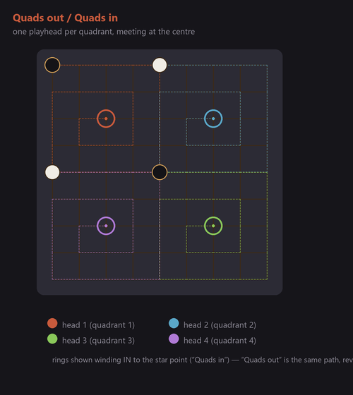
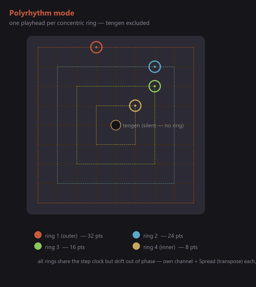

# Go Sequencer — Complete Instructions

A tutorial-style walkthrough of every control and behaviour in the Go
Sequencer plugin, plus how to build it from source. For a quick overview and
a one-page control table, see [README.md](README.md) — this document goes
deeper into *how* and *why* each feature behaves the way it does.

> The screenshots below are mockups — illustrative recreations of the
> plugin's actual dark theme and layout (built from the same colours and
> geometry as [`Source/BoardComponent.h`](Source/BoardComponent.h) /
> [`Source/GoBoard.h`](Source/GoBoard.h)), generated with
> [`docs/mockups/generate.py`](docs/mockups/generate.py) rather than
> captured from a running build.

## Table of contents

1. [First launch](#1-first-launch)
2. [The board and the header](#2-the-board-and-the-header)
3. [Placing and lifting stones](#3-placing-and-lifting-stones)
4. [The SEQUENCER section](#4-the-sequencer-section)
   - [Step rate, Note, Gate, Free Tempo](#step-rate-note-gate-free-tempo)
   - [Mode, Spread, Stone Life, Life Counts](#mode-spread-stone-life-life-counts)
   - [Velocities, Board size, Place](#velocities-board-size-place)
   - [Ko rule, Self capture, Free run, Show path, Clear board](#ko-rule-self-capture-free-run-show-path-clear-board)
5. [The MIDI CHANNELS fold-out](#5-the-midi-channels-fold-out)
6. [The GAME RECORD section](#6-the-game-record-section)
7. [Playhead modes explained in depth](#7-playhead-modes-explained-in-depth)
8. [Stone lifespan in depth](#8-stone-lifespan-in-depth)
9. [Go rules reference](#9-go-rules-reference)
10. [Routing MIDI out (Ableton Live and others)](#10-routing-midi-out-ableton-live-and-others)
11. [Saving and recalling sessions](#11-saving-and-recalling-sessions)
12. [Building it from source](#12-building-it-from-source)
    - [Requirements](#requirements)
    - [Windows](#windows)
    - [macOS / Linux](#macos--linux)
    - [Running the rules-engine tests](#running-the-rules-engine-tests)
    - [Troubleshooting the build](#troubleshooting-the-build)
13. [Installing the built plugin](#13-installing-the-built-plugin)
14. [Project layout reference](#14-project-layout-reference)

---

## 1. First launch

Go Sequencer is a **MIDI instrument** plugin (VST3) and also builds as a
**Standalone** app. It produces no audio of its own — it emits MIDI notes,
so it needs either a host that routes those notes into a synth/sampler
track, or (in Standalone mode) a MIDI output device / virtual MIDI port
feeding something that makes sound.

When the window opens you'll see, top to bottom:

- A **header bar**: the plugin name, a small stone swatch showing the
  colour the *next* click will place, and a status line (step count,
  capture tally, transport state).
- The **Go board** itself, the large clickable area.
- The **SEQUENCER** section: step rate, pitch/gate, playhead mode, stone
  life, velocities, board size, and rule switches.
- A collapsible **MIDI CHANNELS** fold-out.
- A one-line hint reminding you how to interact with the board.
- The **GAME RECORD** section, for loading and scrubbing an SGF file.

The window is resizable (drag any edge/corner); everything reflows.

## 2. The board and the header

The board draws every point as a light grid intersection. Placed stones
render as filled black or white circles. A stone whose lifespan has run out
(see [§8](#8-stone-lifespan-in-depth)) is drawn **faded** — it's still there
for the rules, just silent.

**Header status line** (right-aligned, updates live):

```
step 14/81   captured  black 3  white 1   stopped
```

- `step N/total` — where the (first) playhead currently sits in its cycle.
- An extra field appears in multi-head modes: `4 quadrants` or `N rings`.
- `captured black X white Y` — how many stones of each colour have been
  lifted by capture since the board was last cleared.
- `move N/total` — appears once a game record is loaded, showing position
  in the SGF.
- `running` / `stopped` — whether the step clock is currently advancing
  (see [Free run](#ko-rule-self-capture-free-run-show-path-clear-board)
  below for what makes it run).

Whenever you take an action that needs feedback — a captured/illegal move,
a loaded file, a cleared board — a short message replaces the status line
in the header for about 4–5 seconds, in the accent colour.

## 3. Placing and lifting stones

| Action | Result |
|---|---|
| **Left-click** an empty point | Plays a stone there, if it's a legal Go move (see [§9](#9-go-rules-reference)). Who it plays (black/white) is set by **Place**. |
| **Left-click** an occupied point | Lifts that stone. This is the sequencer's eraser — it ignores Go legality entirely, it's just pattern editing. |
| **Right-click**, or **Shift-click**, or **Alt-click** any point | Also lifts a stone if one is there (an alternate gesture for the same eraser, useful if your right-click is bound elsewhere). |
| Attempt an illegal move (suicide, ko, occupied point) | Nothing is placed; the point **flashes red** briefly and an explanation appears in the header (e.g. *"ko: that would repeat the previous position"*). |



A stone you place is timestamped internally the moment it lands (see
[§8](#8-stone-lifespan-in-depth)), so its lifespan always counts from when
*it* was placed, not from when the transport started.

## 4. The SEQUENCER section



### Step rate, Note, Gate, Free Tempo

- **Step rate** — how often the clock advances, as a musical division
  synced to host tempo: `1/1, 1/2, 1/4, 1/4T, 1/8, 1/8T, 1/16, 1/16T,
  1/32` (default `1/16`). Triplet values are marked `T`.
- **Note** — the base MIDI pitch (shown as a note name, e.g. `C3`). Every
  fired stone's actual pitch is offset from this base by its board
  position (and, in Polyrhythm mode, by that ring's **Spread**).
- **Gate** — note length as a percentage of one step (5%–100%). Short gates
  give a plucky, staccato feel; near 100% lets notes overlap into the next
  step.
- **Free Tempo** — the BPM used when **Free run** is on (20–300 BPM). It's
  ignored while the sequencer is following the host's tempo.

### Mode, Spread, Stone Life, Life Counts

- **Mode** — `Spiral`, `Polyrhythm`, `Quads out`, `Quads in`. Fully
  explained in [§7](#7-playhead-modes-explained-in-depth).
- **Spread** — semitone transpose applied per playhead (−12 to +12). Only
  meaningful once there's more than one playhead, so it's greyed out in
  Spiral mode.
- **Stone Life** — how many steps/placements a stone keeps sounding after
  it's played (1–128; the top value shows as `hold`, meaning stones never
  expire). See [§8](#8-stone-lifespan-in-depth).
- **Life Counts** — whether Stone Life is measured in `Steps` of the
  sequencer clock or `Placements` (stones laid down since).

### Velocities, Board size, Place

- **Black Velocity** / **White Velocity** — fixed MIDI velocity (1–127)
  sent for every note of that colour, in every mode. Doesn't depend on how
  hard you "click" — this is a step sequencer, not a performance
  controller.
- **Board** — `9 x 9` or `13 x 13`. **Changing this clears the board** —
  the two sizes address different points, so nothing to carry over.
- **Place** — who a left-click on an empty point plays next: `Alternate`
  (black/white swap each move, as in a real game), `Black` (always plays
  black), or `White` (always plays white). The header swatch always shows
  the colour that's about to be placed.

### Ko rule, Self capture, Free run, Show path, Clear board

- **Ko rule** (default **on**) — forbids immediately recreating the board
  position that existed right before the previous move (the standard Go
  ko rule, preventing an infinite capture/recapture loop). Turn it off to
  allow ko recaptures freely.
- **Self capture** (default **off**) — when off, playing a stone (or
  group) with zero liberties is refused as *suicide*. Turn it **on** to
  allow it: the stone/group you just played is immediately removed as a
  self-capture instead of being refused. Useful if you want looser,
  non-regulation pattern-editing rules.
- **Free run** (default **off**) — runs the step clock at its own tempo
  (**Free Tempo**, above) instead of following the host's transport and
  tempo. With Free run **off**, the sequencer only advances while the host
  transport is actually playing; pressing stop halts the clock, sends
  all-notes-off, and resets every playhead back to its starting corner
  next time it runs. With Free run **on**, the clock runs continuously
  regardless of the host transport — handy for the Standalone app, or for
  auditioning the board without pressing play in your DAW.
- **Show path** — toggles a faint line on the board tracing each
  playhead's route (the spiral / ring / quadrant path it's following).
  Good for understanding a mode before you commit stones to it.
- **Clear board** — lifts every stone and resets capture counts. This does
  *not* unload a loaded game record; use **Unload** in the GAME RECORD
  section for that.

## 5. The MIDI CHANNELS fold-out



Click the **▸ MIDI CHANNELS** header (it expands to **▾ MIDI CHANNELS**) to
reveal per-colour and per-playhead channel assignments. It stays folded by
default and its open/closed state is **saved with your session**, so it
doesn't clutter every project unless you want it to.

Inside:

- **Black Channel** / **White Channel** (1–16) — used only in **Spiral**
  mode, where routing is by stone colour.
- **Head 1 Channel** … **Head 6 Channel** (1–16) — used only in
  **Polyrhythm** / **Quads** modes, one slider per playhead. A 9×9 board
  uses heads 1–4; a 13×13 board's Polyrhythm mode uses all 6.

Whichever set doesn't apply to the current **Mode**/**Board** combination is
greyed out (not hidden) so you can see and pre-set values you're not
currently using.

Every channel is assigned **outright** — nothing is derived from another
slider. That means two heads (or black and white) can deliberately share a
channel, or the whole board can sit on channel 1, with no side effects.

## 6. The GAME RECORD section



This lets you replay a real Go game's moves onto the board over time,
independent of (and simultaneously with) the step sequencer's own clock —
so the pattern keeps getting rewritten as the game plays.

1. **Load SGF...** opens a file picker filtered to `*.sgf`. Alternatively,
   **drag and drop** an `.sgf` file anywhere onto the plugin window — the
   whole window highlights while a file is dragged over it.
2. Once loaded, the game's **title** and **detail** (players, result, etc.,
   as much as the SGF file provides) appear just above the transport row.
   A sample file is included at
   [`sgf/89706031-145-Gruener123-FloMo.sgf`](sgf/89706031-145-Gruener123-FloMo.sgf).
3. **Move rate** sets how fast recorded moves are played back, independent
   of the sequencer's own **Step rate**: `1/4, 1/2, 1 bar, 2 bars, 4 bars,
   8 bars`, or `one lap` (the move rate automatically matches however long
   one full pass of the current playhead mode takes).
4. **Run game** starts/stops automatic playback of the record at that rate.
5. **Loop** replays the game from move 0 once it reaches the end (only
   relevant while **Run game** is on).
6. The **position slider** ("move N / total") shows and lets you scrub to
   any point in the game directly — dragging it rebuilds the board from
   move 0 up to that point instantly.
7. **◀** / **▶** step exactly one move backward/forward.
8. **Unload** clears the loaded record (the board itself is left as it
   stood — it does *not* clear stones, unlike **Clear board**).

While a game is running, its moves are placed onto the board using the
*same* rules engine as manual clicks (captures, etc. all apply), so
captures from the real game show up in the header's capture tally too.

### Wave Replay

**Wave Replay** is a second way to pace the same game record. Turn it on
and playback never pauses — moves still land one at a time on **Move
Rate**, straight through to the end — but every **Wave Gap** moves *after*
a move first landed, whatever currently occupies that same point gets its
own individual lifespan reset, as if it had just been placed. A move born
at tick 5 gets refreshed at tick 5 + Wave Gap, again at 5 + 2×Wave Gap, and
so on (up to 16 refreshes deep). Because different moves are born on
different ticks, their resets land on different ticks too — the effect
ripples across the board one stone at a time rather than the whole board
flashing back to life together.

Two things follow from that:

- **Stone Life is kept below Wave Gap.** If a stone could already outlive
  a whole Wave Gap on its own, its reset would be a no-op — the wave
  wouldn't be audible. So while Wave Replay is on, raising **Stone Life**
  past **Wave Gap − 1** pulls it back down automatically, and **Wave Gap**
  can't go below 2 (Stone Life's own minimum is 1, so it always needs
  room underneath).
- **Loop is ignored** while Wave Replay is on — the record plays through
  once and holds at the end, the same way ordinary replay holds when Loop
  is off. Wave Replay's resets are keyed to a move's own position in the
  record, so restarting the record from move 0 mid-stream would scramble
  which move a given reset is echoing.

## 7. Playhead modes explained in depth

Set with **Mode**. A "playhead" is an invisible marker stepping through
board points on the sequencer clock; landing on an occupied point fires
that stone's note.

### Spiral (1 playhead)

Starts at the top-left corner and spirals clockwise, winding inward until
it reaches *tengen* (the centre point), then wraps back to the start. This
is the simplest mode — one voice, tracing the whole board once per cycle.
Routing is **by stone colour** (Black Channel / White Channel), which is
why the MIDI Channels fold-out shows those two sliders active here.



### Quads out / Quads in (4 playheads)

The board is split into four quadrant blocks, each centred on that
quadrant's star point (the 3-3 point on a 9×9, 4-4 on a 13×13). The four
blocks are sized so they exactly meet along the board's middle row and
column — together they cover every point once.

- **Quads out**: each playhead starts at its quadrant's star point and
  spirals *outward* toward the block's edges.
- **Quads in**: each playhead starts at the block's outer edge and spirals
  *inward* toward the star point.

All four heads share the same step clock, so they move in lock-step —
useful for symmetric, four-voice patterns that stay rhythmically aligned.
Routing is **by playhead** (Head 1–4 Channel).



### Polyrhythm (4 or 6 playheads)

One playhead per **concentric ring** of the board (tengen is excluded — it
has nowhere to rotate to). A 9×9 board has 4 rings (32, 24, 16, 8 points
around); a 13×13 has 6 rings (48, 40, 32, 24, 16, 8 points).

Every ring shares the same step clock, but because the rings have
different lengths, they drift in and out of phase with each other — they
only all land back at their starting point together every 96 steps on a
9×9 (480 on a 13×13). Each ring has its own **channel** and its own
**pitch transpose** (Spread), and — critically — **all rings sound
together**, so a fully-populated board plays as an evolving chord rather
than a single melodic line. This is the mode to reach for if you want
long-form, slowly-shifting polyrhythmic textures.



## 8. Stone lifespan in depth

Every stone has a lifespan, set by **Stone Life** and measured according to
**Life Counts**:

- **Steps** — counts ticks of the sequencer's step clock since the stone
  was placed. A life of 15 means the stone stops sounding once 15 steps
  have passed, regardless of how many (or how few) other stones were
  placed in that time.
- **Placements** — counts *stones placed* (by anyone/anything: clicks or a
  game record) since this one landed. A life of 15 means it falls silent
  once 15 more stones have been placed, however long that took in real
  time.

When a stone's life runs out:

- It **stays on the board** — it still occupies the point, still blocks
  moves there, and is still subject to capture/liberties like any other
  stone.
- Playheads still pass over it and land on it in sequence, but it no
  longer fires a note.
- The editor draws it **faded** so you can see at a glance which stones
  are currently silent.

**Age is a property of the stone, not of the board.** Each stone remembers
the exact step-count or placement-count it was born on. Both counters
(the step clock and the placement counter) only ever climb — they're never
reset or rebased by the transport stopping, looping, or the host jumping
around its timeline. Two consequences:

1. If you **move the Stone Life slider while the sequencer is running**,
   every stone on the board is immediately re-evaluated against the age
   it has *already* reached. Some previously-silent stones can come back
   to life (if you raised the limit past their current age); some
   currently-sounding stones can go silent (if you lowered it below).
2. Stopping the transport, or letting the host loop, does **not** reset
   any stone's age — a stone placed 40 steps ago is still 40 steps old
   the next time playback starts, even after a stop/loop in between.

Setting **Stone Life** to its maximum value shows as **"hold"**: stones
never expire and stay audible for as long as they remain on the board.

## 9. Go rules reference

The board plays by real Go/Baduk rules, applied in this order whenever you
place a stone:

1. **Capture** — any enemy group adjacent to the new stone that's left with
   zero liberties (no empty adjacent points) is removed from the board
   first.
2. **Suicide check** — *after* those captures, if the group you just
   played still has zero liberties, the move is normally illegal
   (**suicide**) and is refused. Turning **Self capture** on instead
   allows it: your own just-played group is removed too.
3. **Ko rule** — if the resulting position would exactly recreate the
   position that stood immediately before the previous move (the classic
   "immediate recapture" loop), the move is refused. Turning **Ko rule**
   off skips this check.

Illegal attempts don't touch the board — the offending point flashes red
and the header explains why (`"no liberties: self capture is not a legal
move"`, `"ko: that would repeat the previous position"`, `"that point is
taken"`).

The **eraser click** (right-click / Shift-click / Alt-click, or left-click
on any occupied point) bypasses all of this — it's not a Go move, it just
lifts whatever's there. It also forgets any pending ko history at that
point, since it isn't a legal-move sequence anymore.

This rules engine ([`Source/GoBoard.h`](Source/GoBoard.h)) is a
self-contained, JUCE-free C++ header, unit-tested independently — see
[Running the rules-engine tests](#running-the-rules-engine-tests).

## 10. Routing MIDI out (Ableton Live and others)

Go Sequencer is built (`IS_SYNTH TRUE`, `NEEDS_MIDI_OUTPUT TRUE`,
`IS_MIDI_EFFECT FALSE`) to sit on an instrument track and produce MIDI,
exactly the shape a host expects a note-generating instrument to have.

**Ableton Live:**

1. Drop **Go Sequencer** onto a MIDI track.
2. Create a **second** MIDI track and load a synth/sampler on it (any of
   Live's own instruments work).
3. On that second track, set **MIDI From** → *(Go Sequencer's track)* →
   *Go Sequencer*, and set the track's monitor to **In** (or arm it).
4. Press play (or turn on **Free run** if you'd rather it play without the
   transport running). Clicking stones on the board — or a loaded game
   record — now plays notes through the second track's instrument.

The same pattern (route one track's MIDI output into another track's
input) works in Cubase, Studio One, Reaper, Bitwig, and most other hosts
that support inter-track MIDI routing.

**Standalone app:** select a MIDI output device (or a virtual MIDI port
such as loopMIDI on Windows) in the app's audio/MIDI settings, and point
whatever's listening on that port — hardware synth, another app — at it.

## 11. Saving and recalling sessions

Every control here is a JUCE `AudioProcessorValueTreeState` parameter, so
your host's normal plugin-state saving covers all of it automatically: the
board (which stones are placed), rate/note/gate, mode, all channel
assignments, rule switches, the MIDI Channels fold-out's open/closed state,
and — separately — the loaded game record and its current scrub position.
Saving your DAW project (or a plugin preset, if your host supports them)
recalls the sequencer exactly as you left it, board included.

## 12. Building it from source

### Requirements

- **CMake** ≥ 3.22
- A C++17 toolchain — MSVC (Visual Studio 2022) on Windows, Xcode on
  macOS, or GCC/Clang on Linux
- A [JUCE](https://github.com/juce-framework/JUCE) checkout — **not**
  vendored in this repo, you clone it yourself

### Windows

```powershell
# 1. Clone JUCE next to this project (default expected path)
git clone --depth 1 https://github.com/juce-framework/JUCE.git ..\.toolchains\JUCE

# 2. Configure + build + run the rules tests, all in one step
.\build.ps1

# ...and to also copy the built VST3 into your VST3 folder:
.\build.ps1 -Install
```

`build.ps1` flags:

| Flag | Effect |
|---|---|
| *(none)* | Configure, build Release, run `GoRulesTests`. |
| `-Config Debug` | Build a Debug configuration instead. |
| `-Clean` | Delete `build/` first, for a from-scratch rebuild. |
| `-Install` | After building, copy the `.vst3` into `%CommonProgramFiles%\VST3` (falls back to `%LOCALAPPDATA%\Programs\Common\VST3` if the first isn't writable). |

Equivalent raw CMake, if you'd rather not use the script:

```powershell
cmake -B build -G "Visual Studio 17 2022" -A x64
cmake --build build --config Release --target GoSequencer_VST3 GoSequencer_Standalone
```

If your JUCE checkout lives somewhere other than
`../.toolchains/JUCE`, point CMake at it explicitly:

```powershell
cmake -B build -DJUCE_PATH="C:\path\to\JUCE" -G "Visual Studio 17 2022" -A x64
```

### macOS / Linux

```bash
git clone --depth 1 https://github.com/juce-framework/JUCE.git ../.toolchains/JUCE
cmake -B build -DCMAKE_BUILD_TYPE=Release
cmake --build build --target GoSequencer_VST3 GoSequencer_Standalone -j
```

### Running the rules-engine tests

[`Source/GoBoard.h`](Source/GoBoard.h) — captures, suicide, ko, scoring —
has no JUCE dependency, so it's tested standalone. The test replays the
included sample SGF game through the engine and checks the result matches.

```powershell
cmake --build build --target GoRulesTests --config Release
ctest --test-dir build -C Release --output-on-failure
```

(`build.ps1` runs this automatically after every build.)

### Troubleshooting the build

- **"JUCE was not found at ..."** — CMake's error tells you the exact path
  it looked in; clone JUCE there, or re-run with `-DJUCE_PATH=...`
  pointing at an existing checkout.
- **Linker errors about the VC++ runtime** — the project statically links
  the CRT (`CMAKE_MSVC_RUNTIME_LIBRARY` = MultiThreaded) so the built
  `.vst3` has no redistributable dependency; make sure you're building
  with the MSVC generator (Visual Studio 17 2022), not Ninja/MinGW, or
  adjust that setting in `CMakeLists.txt` to match your toolchain.
- **DAW doesn't see the plugin after building** — you built it but didn't
  copy/install it; see [§13](#13-installing-the-built-plugin) below, or
  just re-run `.\build.ps1 -Install`.
- **Rescan needed** — after installing, most hosts need a manual
  plugin rescan (Live: Preferences → Plug-Ins → Rescan).

## 13. Installing the built plugin

Build artefacts land under `build/GoSequencer_artefacts/<Config>/`:

- `VST3/Go Sequencer.vst3` — copy (or let `build.ps1 -Install` copy) into:
  - Windows: `C:\Program Files\Common Files\VST3\`
  - macOS: `~/Library/Audio/Plug-Ins/VST3/`
  - Linux: `~/.vst3/`
- `Standalone/Go Sequencer.exe` (or `.app` on macOS) — runs directly, no
  host needed; just double-click it.

After copying a new VST3 build over an existing one, rescan plugins in
your DAW (most hosts cache their plugin list).

## 14. Project layout reference

```
GoSequencer/
├── CMakeLists.txt          # Build configuration (JUCE plugin + rules tests)
├── build.ps1                # Windows one-shot configure/build/test/install script
├── Source/
│   ├── PluginProcessor.*   # Audio/MIDI engine: playheads, clock, params, state
│   ├── PluginEditor.*      # Plugin UI: all sliders/combos/buttons, board layout
│   ├── BoardComponent.*    # The clickable Go board widget and its painting
│   ├── GoBoard.h           # Standalone Go/Baduk rules engine (no JUCE deps)
│   └── SgfParser.h         # Minimal SGF (game record) reader
├── sgf/                    # Sample game record for trying SGF playback
└── tests/
    └── GoRulesTests.cpp    # Rules-engine unit test, run via ctest
```

For a shorter overview, see [README.md](README.md).
