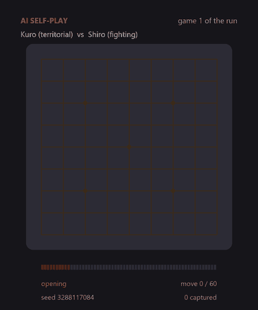
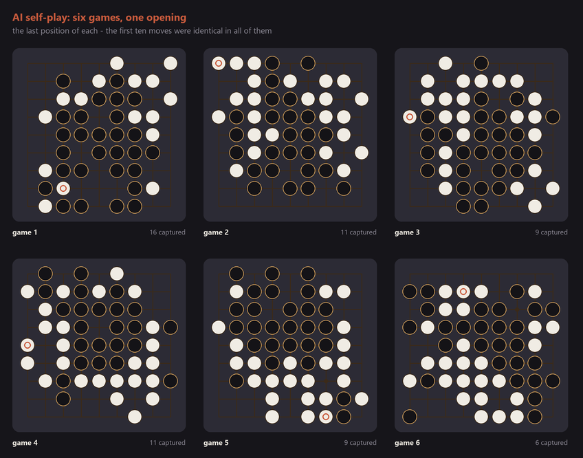

# Go Sequencer — Complete Instructions

A tutorial-style walkthrough of every control and behaviour in the Go
Sequencer plugin, plus how to build it from source. For a quick overview and
a one-page control table, see [README.md](README.md) — this document goes
deeper into *how* and *why* each feature behaves the way it does.

> The screenshots below are mockups generated with
> [`docs/mockups/generate.py`](docs/mockups/generate.py) rather than captured
> from a running build, and they still show the plugin's earlier dark,
> single-column layout. The editor is now light and tabbed — the board on the
> left, the controls split across the **Sequencer**, **Board**, **Channels**,
> **Game** and **AI** tabs on the right — so read them for what each control
> does, not for where it sits on screen.

## Table of contents

1. [First launch](#1-first-launch)
2. [The board and the header](#2-the-board-and-the-header)
3. [Placing and lifting stones](#3-placing-and-lifting-stones)
4. [The Sequencer and Board tabs](#4-the-sequencer-and-board-tabs)
   - [Step rate, Note, Gate, Free Tempo](#step-rate-note-gate-free-tempo)
   - [Mode, Spread, Stone Life, Life Counts](#mode-spread-stone-life-life-counts)
   - [Board size, Place](#board-size-place)
   - [Ko rule, Self capture, Free run, Clear board](#ko-rule-self-capture-free-run-clear-board)
5. [The Channels tab](#5-the-channels-tab)
6. [The Game and AI tabs](#6-the-game-and-ai-tabs)
   - [AI self-play](#ai-self-play)
   - [The players, and what Leela gave them](#the-players-and-what-leela-gave-them)
   - [Wave Replay](#wave-replay)
   - [Playing against the AI](#playing-against-the-ai)
7. [Playhead modes explained in depth](#7-playhead-modes-explained-in-depth)
8. [Stone lifespan in depth](#8-stone-lifespan-in-depth)
9. [Go rules reference](#9-go-rules-reference)
10. [Routing MIDI out (Ableton Live and others)](#10-routing-midi-out-ableton-live-and-others)
    - [One track per channel: the MIDI out port (needs loopMIDI)](#one-track-per-channel-the-midi-out-port-needs-loopmidi)
11. [The Launchpad X (the Pads tab)](#11-the-launchpad-x-the-pads-tab)
    - [Connecting it](#connecting-it)
    - [What the pads and buttons do](#what-the-pads-and-buttons-do)
12. [Saving and recalling sessions](#12-saving-and-recalling-sessions)
13. [Building it from source](#13-building-it-from-source)
    - [Requirements](#requirements)
    - [Windows](#windows)
    - [macOS / Linux](#macos--linux)
    - [Running the rules-engine tests](#running-the-rules-engine-tests)
    - [Troubleshooting the build](#troubleshooting-the-build)
14. [Installing the built plugin](#14-installing-the-built-plugin)
15. [Project layout reference](#15-project-layout-reference)

---

## 1. First launch

Go Sequencer is a **MIDI instrument** plugin (VST3). It produces no audio
of its own — it emits MIDI notes, so it needs a host that routes those
notes into a synth/sampler track feeding something that makes sound.

When the window opens you'll see two columns.

On the left, the **Go board** itself — the large clickable area, as big as
the window's height allows — with the two dropdowns that decide what a click
on it does underneath: **Board** (its size) and **Place** (who plays next).
They stay there whichever tab is open.

On the right, top to bottom:

- A **header**: the plugin name, a small stone swatch showing the colour the
  *next* click will place, and under it a status line (step count, capture
  tally, transport state).
- A row of six **tabs**, and under it the controls of the open one:
  - **Sequencer** — step rate, note, gate, playhead mode, stone life, free
    run and spread.
  - **Board** — the rule switches, Clear board, and a reminder of
    how to interact with the board.
  - **Channels** — both velocities, every MIDI channel assignment, and the
    optional MIDI out port.
  - **Game** — loading, running and scrubbing an SGF record, and Wave Replay.
  - **AI** — self-play and the opening it starts from, and playing a game
    against the players.
  - **Pads** — connecting a Launchpad X, whose pads then show and play the
    board.

Only one tab is shown at a time and every tab takes the same space, so
switching never resizes the window; the tab you left open is saved with the
session. The window is resizable (drag the corner), and the board grows with
it.

## 2. The board and the header

The board draws every point as a light grid intersection. Placed stones
render as flat black or white discs. A stone whose lifespan has run out
(see [§8](#8-stone-lifespan-in-depth)) is drawn **faded** — it's still there
for the rules, just silent.

**Header status line** (under the plugin name, updates live):

```
step 14/81  ·  captured  black 3  white 1  ·  stopped
```

- `step N/total` — where the (first) playhead currently sits in its cycle.
- An extra field appears in multi-head modes: `4 quadrants` or `N rings`.
- `captured black X white Y` — how many stones of each colour have been
  lifted by capture since the board was last cleared.
- `move N/total` — appears once a game record is loaded, showing position
  in the SGF.
- `running` / `stopped` — whether the step clock is currently advancing
  (see [Free run](#ko-rule-self-capture-free-run-clear-board)
  below for what makes it run).

Whenever you take an action that needs feedback — a captured/illegal move,
a loaded file, a cleared board — a short message replaces the status line
in the header for about 4–5 seconds, in the accent colour.

## 3. Placing and lifting stones

| Action | Result |
|---|---|
| **Left-click** an empty point | Plays a stone there, if it's a legal Go move (see [§9](#9-go-rules-reference)). Who it plays (black/white) is set by **Place**. |
| **Left-click** an occupied point | Lifts that stone. This is the sequencer's eraser — it ignores Go legality entirely, it's just pattern editing. |
| **Right-click**, or **Shift-click**, or **Alt-click** any point | Also lifts a stone if one is there (an alternate gesture for the same eraser, useful if your right-click is bound elsewhere). |
| Attempt an illegal move (suicide, ko, occupied point) | Nothing is placed; the point **flashes red** briefly and an explanation appears in the header (e.g. *"ko: that would repeat the previous position"*). |


A stone you place is timestamped internally the moment it lands (see
[§8](#8-stone-lifespan-in-depth)), so its lifespan always counts from when
*it* was placed, not from when the transport started.

## 4. The Sequencer and Board tabs


The **Sequencer** tab holds the clock and the pitch: step rate, note, gate,
mode, stone life and life counts, free run and free tempo, and spread. The
**Board** tab holds the rules and the board's own switches: Ko rule, Self
capture and Clear board. **Board** size and **Place** are not on a
tab at all — they sit under the board, since they decide what a click on it
does.

### Step rate, Note, Gate, Free Tempo

- **Step rate** — how often the clock advances, as a musical division
  synced to host tempo: `1/1, 1/2, 1/4, 1/4T, 1/8, 1/8T, 1/16, 1/16T,
  1/32` (default `1/16`). Triplet values are marked `T`.
- **Note** — the base MIDI pitch (shown as a note name, e.g. `C3`). Every
  fired stone's actual pitch is offset from this base by its board
  position (and, in Polyrhythm mode, by that ring's **Spread**).
- **Gate** — note length as a percentage of one step (5%–100%). Short gates
  give a plucky, staccato feel; near 100% lets notes overlap into the next
  step.
- **Free Tempo** — the BPM used when **Free run** is on (20–300 BPM). It's
  ignored while the sequencer is following the host's tempo.

### Mode, Spread, Stone Life, Life Counts

- **Mode** — `Spiral`, `Polyrhythm`, `Quads out`, `Quads in`. Fully
  explained in [§7](#7-playhead-modes-explained-in-depth).
- **Spread** — semitone transpose applied per playhead (−12 to +12). Only
  meaningful once there's more than one playhead, so it's greyed out in
  Spiral mode.
- **Stone Life** — how many steps/placements a stone keeps sounding after
  it's played (1–128; the top value shows as `hold`, meaning stones never
  expire). See [§8](#8-stone-lifespan-in-depth).
- **Life Counts** — whether Stone Life is measured in `Steps` of the
  sequencer clock or `Placements` (stones laid down since).

### Board size, Place

These two sit under the board, not on a tab.

- **Board** — `9 x 9`, `13 x 13`, `19 x 19` or `8 x 8`. **Changing this
  clears the board** — the sizes address different points, so nothing to
  carry over. The full 19×19 board draws all nine star points and runs its
  coordinates out to `T`; a one-lap Spiral on it is 361 steps, so it suits
  the faster step rates or Polyrhythm/Quads. The 8×8 comes last in the list
  because it was added last: it's the size of a Launchpad X's grid (see
  [§11](#11-the-launchpad-x-the-pads-tab)), and the only board with an even
  side — so it has no tengen, and four star points rather than five.
- **Place** — who a left-click on an empty point plays next: `Alternate`
  (black/white swap each move, as in a real game), `Black` (always plays
  black), or `White` (always plays white). The header swatch always shows
  the colour that's about to be placed.

### Ko rule, Self capture, Free run, Clear board

- **Ko rule** (default **on**) — forbids immediately recreating the board
  position that existed right before the previous move (the standard Go
  ko rule, preventing an infinite capture/recapture loop). Turn it off to
  allow ko recaptures freely.
- **Self capture** (default **off**) — when off, playing a stone (or
  group) with zero liberties is refused as *suicide*. Turn it **on** to
  allow it: the stone/group you just played is immediately removed as a
  self-capture instead of being refused. Useful if you want looser,
  non-regulation pattern-editing rules.
- **Free run** (default **off**) — runs the step clock at its own tempo
  (**Free Tempo**, above) instead of following the host's transport and
  tempo. With Free run **off**, the sequencer only advances while the host
  transport is actually playing; pressing stop halts the clock, sends
  all-notes-off, and resets every playhead back to its starting corner
  next time it runs. With Free run **on**, the clock runs continuously
  regardless of the host transport — handy for auditioning the board
  without pressing play in your DAW.
- **Clear board** — lifts every stone and resets capture counts. This does
  *not* unload a loaded game record; use **Unload** on the Game tab for
  that.

## 5. The Channels tab

Everything that decides how loud a note goes out, and on which channel:

- **Black Velocity** / **White Velocity** — fixed MIDI velocity (1–127)
  sent for every note of that colour, in every mode. Doesn't depend on how
  hard you "click" — this is a step sequencer, not a performance
  controller.
- **Black Channel** / **White Channel** (1–16) — used only in **Spiral**
  mode, where routing is by stone colour.
- **Head 1** … **Head 9** (1–16) — used only in
  **Polyrhythm** / **Quads** modes, one slider per playhead. Quads always
  uses heads 1–4, as does Polyrhythm on a 9×9; a 13×13's Polyrhythm uses
  heads 1–6, and a 19×19's uses all 9. They start out on channels 1–9.
- **MIDI out port** — sends every note to one of your system's MIDI ports
  *as well as* to the host, on exactly the channels set above. **Off** (the
  default) sends to the host only and uses no port at all. It is there for
  hosts that throw the channel away on their own track-to-track routing —
  Ableton Live does — and on Windows it needs a virtual port from
  **loopMIDI**: see
  [One track per channel](#one-track-per-channel-the-midi-out-port-needs-loopmidi).
  The line under it says whether the port is open (*also sending to GoSeq…*)
  or not there (*waiting for GoSeq – is loopMIDI running?*, in the accent
  colour). The list is read again every time you open it, so a port created
  while the plugin window is open shows up without reopening it.

Whichever set doesn't apply to the current **Mode**/**Board** combination is
greyed out (not hidden) so you can see and pre-set values you're not
currently using.

Every channel is assigned **outright** — nothing is derived from another
slider. That means two heads (or black and white) can deliberately share a
channel, or the whole board can sit on channel 1, with no side effects.

## 6. The Game and AI tabs


The **Game** tab lets you replay a real Go game's moves onto the board over
time, independent of (and simultaneously with) the step sequencer's own
clock — so the pattern keeps getting rewritten as the game plays.

1. **Load SGF…** opens a file picker filtered to `*.sgf`. Alternatively,
   **drag and drop** an `.sgf` file anywhere onto the plugin window,
   whichever tab is open — the window is outlined while a file is dragged
   over it.
2. Once loaded, the game's **title** and **detail** (players, result, etc.,
   as much as the SGF file provides) appear at the top of the tab.
3. **Move rate** sets how fast recorded moves are played back, independent
   of the sequencer's own **Step rate**: `1/4, 1/2, 1 bar, 2 bars, 4 bars,
   8 bars`, or `one lap` (the move rate automatically matches however long
   one full pass of the current playhead mode takes).
4. **Run game** starts/stops automatic playback of the record at that rate.
5. **Loop** replays the game from move 0 once it reaches the end (only
   relevant while **Run game** is on).
6. The **position slider** ("move N / total") shows and lets you scrub to
   any point in the game directly — dragging it rebuilds the board from
   move 0 up to that point instantly.
7. **‹** / **›** step exactly one move backward/forward.
8. **Unload** clears the loaded record (the board itself is left as it
   stood — it does *not* clear stones, unlike **Clear board**).

While a game is running, its moves are placed onto the board using the
*same* rules engine as manual clicks (captures, etc. all apply), so
captures from the real game show up in the header's capture tally too.

### AI self-play

Instead of loading a record, the plugin can write one. Turn on **AI self-play**
on the **AI** tab and two players take the board — game after game, for as long
as **Loop** is on, with no file and nothing to connect to. Everything on the
**Game** tab keeps working unchanged: a generated game *is* a record, so
**Move Rate**, **Run game**, **Loop**, the position slider and **‹** / **›**
all behave exactly as they do for an `.sgf`.



**The same opening, every time.** Every game plays the same ten opening moves
and diverges from the eleventh. That is deliberate, and it is the musical point
of the feature: the sequencer turns position into pitch, so a fixed opening is a
fixed motif — you hear the same figure at the start of every game, and then a
variation on it that never repeats. On the two small boards the built-in one is
real play, not a made-up pattern: the first ten moves of
`sgf/nine_dan_9x9_43610191.sgf` on a 9×9, and of
`sgf/Blackie_BIBA_13x13_25655059.sgf` on a 13×13. There is no 19×19 record to
take one from, so the full board opens on a textbook line: Q16, D4, Q4, D16 —
the four star points — then the commonest star-point joseki twice over (low
approach, small knight's move, two-space extension): F17, C14, J17 in the upper
left, R6, O3, R9 in the lower right.

**Playing your own opening.** The two buttons under the settings on the
**AI** tab set where those ten moves come from:

1. Press **Clear board** (on the **Board** tab), and set **Place** — under the
   board — to *Alternate*.
2. Click out your ten stones — your joseki, a shape you like the sound of,
   anything legal.
3. Press **From board**. The line under the buttons changes from *the book
   line* to *your ten moves*, and every game of every run from then on starts
   with them.
4. **Use book** puts the built-in opening back.

Two things are worth knowing about how that works. An opening is a **sequence,
not a position**: the order the stones went down in decides what gets captured
and what is legal, and the board itself keeps no order. So what gets taken is
the order you clicked in, not the shape left standing — and lifting a stone
takes it back out of that sequence again. And the ten have to be a real opening:
alternating, Black first, and legal one after another from an empty board. If
they are not, the button says which move is the problem rather than quietly
taking something else (the usual cause is **Place** being left on *Black*).

Like the three sliders, a new opening is read when the next game is written, so
it lands on the next game rather than cutting the current one short.

The opening is saved with the session, and it belongs to the board size it was
played on — the same points mean something else on a 13×13. Changing size
therefore falls back to the built-in book for that board, and the line under
the buttons says so.

**The two players** — Black is *Kuro*, White is *Shiro* — come in two
generations, picked with **Players** on the **AI** tab. Both are algorithms,
not AI in the machine-learning sense: every legal point gets a score from fixed
rules, and one of the best twelve is drawn with the seeded random number
generator. There is no neural network and no training, and nothing learns while
you play — more on that in
[The players, and what Leela gave them](#the-players-and-what-leela-gave-them).

- **Reading** — the default for a new instance. Before scoring a point they
  read the board as chains of stones: what a move captures or saves, whether a
  self-atari is a blunder or a useful throw-in, whether an atari starts a ladder
  that catches the stones, whether running out of atari runs into one, the vital
  points of small eye spaces, which liberties to fill in a race, which eyes a
  move makes or spoils, and whose area a point already lies in. The ideas come
  from the Go engine [**Leela**](https://github.com/gcp/Leela).
- **Classic** — the original pair. Each scores every legal point on a handful of
  things a beginner would recognise — stones captured, own stones saved from
  atari, enemy groups put in atari, cuts, connections, distance from the last
  move, distance from its own nearest stone, which line it sits on — and reads
  nothing ahead.

What makes each pair two players rather than one is the weighting, and both
generations keep it:

| | Black — *Kuro*, territorial | White — *Shiro*, fighting |
|---|---|---|
| wants | its stones safe and connected, the third line, calm extensions | contact, cuts, ataris, whatever is happening right now |
| fights | when there is something to take | as a matter of course |

One rule overrides all of it: **neither player will fill its own eye.** Without
that, two heuristic players take their own groups apart in the endgame and the
board empties out — there is a test for exactly this in
[`tests/GoRulesTests.cpp`](tests/GoRulesTests.cpp).

How much stronger the reading pair are, played out to the end against the
classic pair (komi 7.5, area scoring, variation 35, on seeds the weights were
never tuned on):

| | 9×9, 1000 games each | 13×13, 300 games each |
|---|---|---|
| classic Kuro vs classic Shiro | Black wins 38%, by −5.3 on average | Black wins 38%, −9.0 |
| **reading** Kuro vs classic Shiro | Black wins 58%, +6.8 | Black wins 83%, +32.5 |
| classic Kuro vs **reading** Shiro | Black wins 15%, −26.6 | Black wins 2%, −48.2 |

What you hear changes less than how well they play. Over sixty moves the
records keep the same shape — about as many stones left standing, an average
jump of about three points from one move to the next — but the reading pair lose
fewer stones, rarely touch the first line on the larger boards, and wander over
a few more points of the board. Writing a game takes a little longer too: about
2 ms rather than 1 ms for a default game on a 9×9, and 25 ms rather than 19 ms
for the longest, 160 moves on a 19×19.

**The four settings** sit with the switch on the **AI** tab:

- **Players** — *Reading* or *Classic*, as above.
- **Game length** — 12 to 160 moves, the ten book moves included. 60 is the
  default: long enough for a middlegame fight, short enough that the opening
  comes round again.
- **Variation** — how far the players stray from the best point they can see.
  At **0%** they never stray, so the seed stops mattering and the run becomes
  one game repeating — a strict loop. At **100%** they pick freely among their
  best twelve, which gets loose and takes fewer stones. **35%**, the default,
  keeps the play recognisable and makes every game different by around move 11.
- **Seed** — names the run. The same seed plays the same games in the same
  order, on any machine and in any host — for the same **Players**: the two
  generations play different games from one seed.

All four are read when a game is *written*, which happens one game ahead of
the one you are hearing. So changing any of them lands on the next game rather
than cutting the current one short. To start a fresh run immediately, switch
**AI self-play** off and on again — that always begins at game 1.

**How it shares the board.** Loading an `.sgf`, or pressing **Unload**, hands
the board back and switches self-play off, so the switch never sits on while
something else is playing. Changing the board size restarts the run at game 1
on the new board — the points mean something else now. **Wave Replay** holds a
run on one game for as long as it is on: the wave is rippling stones that the
next game would not have played, and swapping the record underneath it would
cut every echo head off at once.

**Saving.** A generated record is not written into the session — the players,
the seed, the game number and your opening if you set one are, and the game is
played again from them when the session opens. It comes back identical, down to
the move you left it on. (This is why there is not a single floating-point
number in [`Source/GoAI.h`](Source/GoAI.h) or
[`Source/GoTactics.h`](Source/GoTactics.h): float arithmetic differs a little
between compilers, and a single near-tie falling the other way would be a
different game from that move on.) A session saved before there was a
**Players** choice comes back with the *Classic* pair, who played it.

**Getting the games out.** The same players can be run outside the plugin,
where they write ordinary `.sgf` files you can load back into it, study in a Go
viewer, or keep. `--players reading` picks the reading pair; without it you get
the classic one:

```powershell
cmake --build build --config Release --target GoAiDump
.\build\Release\GoAiDump.exe --games 6 --seed 1 --moves 60 --variation 35 --players reading --out sgf\selfplay
```



### The players, and what Leela gave them

The reading players are built on ideas from
**[Leela](https://github.com/gcp/Leela)**, the Go engine Gian-Carlo Pascutto
started around 2006–2007 and released under the MIT licence — the program Leela
Zero later grew out of. Its source was read, not copied: every idea below was
written again for this plugin, in whole numbers, on its own rules engine
([`Source/GoTactics.h`](Source/GoTactics.h) and [`Source/GoAI.h`](Source/GoAI.h)).

**What Leela gave them.** Leela decides which moves are worth trying by looking
at a short list of facts about each one. The reading players look at the same
list:

| Fact | What the players do with it |
|---|---|
| **Captures and rescues** | Taking stones that could run away is urgent; taking stones that are dead anyway can wait. Saving a group from atari is worth a lot — unless the escape runs into a ladder. |
| **Self-atari** | Leaving your own stones on one liberty is a blunder — except as a throw-in against a group that is short of liberties itself, or on a vital point. |
| **Ladders** | An atari that chases stones along a ladder to the edge counts as a capture; running from atari into a ladder that works counts as losing the stones. |
| **Liberty races** | When two groups can only survive by capturing each other, fill the other side's outside liberties first. |
| **Eye shapes** | The straight and bent three, pyramid four, bulky and crossed five and rabbity six each have one vital point: the owner lives by playing it, the other side kills by playing it. |
| **Territory** | Bouzy's influence map tells whose area a point already lies in, so a quiet move is not wasted inside its own area or thrown away inside the other side's. |

**What Leela did not give them.** Leela's strength comes from a Monte Carlo tree
search — thousands of simulated games for every move — and from pattern tables
and neural networks trained on recorded games. None of that is here: it would
take far more work than a sequencer should spend between notes, and it could not
promise the same game from the same seed on every machine.

**No AI, no training — just algorithms.** The **AI** in the tab's name means
that the plugin plays both sides of a game by itself; it does not mean
artificial intelligence in the machine-learning sense, and neither pair of
players uses any. There is no neural network, no model and no training data, and
nothing learns: not while a game is written, not while you play, not between
sessions. Each move is plain arithmetic — score every legal point with fixed
rules, read out the few ladders that matter, draw one of the best points with
the seeded random number generator. The scoring weights are ordinary numbers in
the source. The reading pair's were first set by hand and then adjusted once,
offline, by playing thousands of test games between versions and keeping the
changes that won; after that they were written into the code, and they never
change.

**The 8×8 is tuned on its own, with KataGo as the judge.** On an 8×8 the reading
pair use a second set of weights. Those were adjusted offline with
[**KataGo**](https://github.com/lightvector/KataGo) — a strong Go program by
David J. Wu that *does* use a neural network — marking how many points each
possible move in tens of thousands of their positions gives away, and keeping
the weight changes that made them give away less. KataGo only marked moves, on
the development machine: it is not part of the plugin, is never run while you
play, and the result is fixed numbers like every other weight. On fresh test
games the 8×8 players now give away about 5.5 points a move where the 9×9
weights gave away 5.7 (the classic pair: 6.7). Details in the README, under *The
8×8 weights (KataGo)*.

### Wave Replay

**Wave Replay** is a second way to pace the same game record. Turn it on
and playback never pauses — moves still land one at a time on **Move
Rate**, straight through to the end — but every **Wave Gap** moves *after*
a move first landed, whatever currently occupies that same point gets its
own individual lifespan reset, as if it had just been placed. A move born
at tick 5 gets refreshed at tick 5 + Wave Gap, again at 5 + 2×Wave Gap, and
so on (up to 16 refreshes deep). Because different moves are born on
different ticks, their resets land on different ticks too — the effect
ripples across the board one stone at a time rather than the whole board
flashing back to life together.

Three things follow from that:

- **Stone Life is kept below Wave Gap.** If a stone could already outlive
  a whole Wave Gap on its own, its reset would be a no-op — the wave
  wouldn't be audible. So while Wave Replay is on, raising **Stone Life**
  past **Wave Gap − 1** pulls it back down automatically, and **Wave Gap**
  can't go below 2 (Stone Life's own minimum is 1, so it always needs
  room underneath).
- **Loop wraps the record without clearing the board.** Each refresh level
  is really a replay head: level *k* is the head that set off *k* × Wave
  Gap moves ago, and since the stone it would play is already standing,
  playing it can only mean refreshing it. Wiping the board at the loop
  point would cut all sixteen of those heads off at once, so with Wave
  Replay on the wrap leaves the stones where they are and the refresh
  levels wrap with the record — at move 1 of a new pass, level 1 reaches
  back into the tail of the previous one. The wave runs unbroken until you
  stop the transport.

  Two side effects worth knowing. The record's own head starts landing on
  points it already owns, and those moves become refreshes too rather than
  placements. And because captured stones *are* lifted, those points get
  genuinely replayed next pass — so the board keeps some churn for a while,
  then settles. Once it's full you're hearing the finished shape ripple
  rather than a game replaying, which is the point of leaving it standing.

With Wave Replay **off**, Loop behaves as it always has: the board is wiped
and the record replays from move 0.

### Playing against the AI

The same players can answer your moves one at a time instead of writing whole
games — on the screen, or on a [Launchpad](#11-the-launchpad-x-the-pads-tab).

- **Play against** (at the bottom of the AI tab) starts a game on an empty
  board. A game owns the board, so AI self-play and **Run game** switch off
  and a loaded record is unloaded — and loading a record or starting
  self-play ends the game in turn.
- **They play** is their colour: *White* (the default — you open) or *Black*
  (they open). Changing it during a game starts the game again.
- Place a stone and their answer lands straight after it. They play with the
  **Players** and **Variation** set above, and their answers follow from the
  **Seed** — play the same moves and you get the same replies.
- **The colours simply alternate** — **Place** doesn't apply during a game —
  and the board won't take a stone while it's their move.
- **Stones can't be lifted during a game.** The position is the record of the
  game, and taking a move back out of it would make it a different game.
- **Pass** hands them the move. If they find nothing worth playing they pass
  too, and two passes in a row end the game. The line under the buttons says
  whose move it is and, once it's over, how many stones each side captured.
  There's no scoring.
- **New game** empties the board and starts again.

The board is the sequencer's pattern the whole time, so a game against them
is just another way of writing one. Its first ten moves can become the
self-play opening with **From board**, like any ten you played.

## 7. Playhead modes explained in depth

Set with **Mode**. A "playhead" is an invisible marker stepping through
board points on the sequencer clock; landing on an occupied point fires
that stone's note.

### Spiral (1 playhead)

Starts at the top-left corner and spirals clockwise, winding inward until
it reaches *tengen* (the centre point), then wraps back to the start. This
is the simplest mode — one voice, tracing the whole board once per cycle.
Routing is **by stone colour** (Black Channel / White Channel), which is
why the Channels tab shows those two sliders active here.


### Quads out / Quads in (4 playheads)

The board is split into four quadrant blocks, each centred on that
quadrant's star point (the 3-3 point on a 9×9, 4-4 on a 13×13). The four
blocks are sized so they exactly meet along the board's middle row and
column — together they cover every point, the shared middle cross twice
(tengen four times).

On a **19×19** the blocks are 10×10 (100 steps each). An even-sided block has
no single centre point, so each spiral winds in to the square of four points
in the middle of its corner — the 5-5 to 6-6 points — and the 4-4 star point
sits on the ring just outside that.

An **8×8** has no middle row or column to share: its four 4×4 blocks sit side
by side and tile the board, so every point is played exactly once a lap and
the four heads never meet. Like the 19×19's, each block's spiral ends on the
square of four points in its middle.

- **Quads out**: each playhead starts at the middle of its block (the star
  point, on 9×9 and 13×13) and spirals *outward* toward the block's edges.
- **Quads in**: each playhead starts at the block's outer edge and spirals
  *inward* toward the middle.

All four heads share the same step clock, so they move in lock-step —
useful for symmetric, four-voice patterns that stay rhythmically aligned.
Routing is **by playhead** (Head 1–4 Channel).


### Polyrhythm (4, 6 or 9 playheads)

One playhead per **concentric ring** of the board (tengen is excluded — it
has nowhere to rotate to). A 9×9 board has 4 rings (32, 24, 16, 8 points
around); a 13×13 has 6 rings (48, 40, 32, 24, 16, 8 points); a 19×19 has 9
rings (72, 64, 56, 48, 40, 32, 24, 16, 8 points). An 8×8 has 4 rings too
(28, 20, 12, 4 points) and leaves nothing out: an even board has no tengen,
and its innermost ring is the square of four points in the middle.

Every ring shares the same step clock, but because the rings have
different lengths, they drift in and out of phase with each other — they
only all land back at their starting point together every 96 steps on a
9×9 (420 on an 8×8, 480 on a 13×13, and 20,160 on a 19×19 — at 1/16 and
120 BPM, exactly
42 minutes). Each ring has its own **channel** and its own
**pitch transpose** (Spread), and — critically — **all rings sound
together**, so a fully-populated board plays as an evolving chord rather
than a single melodic line. This is the mode to reach for if you want
long-form, slowly-shifting polyrhythmic textures.


## 8. Stone lifespan in depth

Every stone has a lifespan, set by **Stone Life** and measured according to
**Life Counts**:

- **Steps** — counts ticks of the sequencer's step clock since the stone
  was placed. A life of 15 means the stone stops sounding once 15 steps
  have passed, regardless of how many (or how few) other stones were
  placed in that time.
- **Placements** — counts *stones placed* (by anyone/anything: clicks or a
  game record) since this one landed. A life of 15 means it falls silent
  once 15 more stones have been placed, however long that took in real
  time.

When a stone's life runs out:

- It **stays on the board** — it still occupies the point, still blocks
  moves there, and is still subject to capture/liberties like any other
  stone.
- Playheads still pass over it and land on it in sequence, but it no
  longer fires a note.
- The editor draws it **faded** so you can see at a glance which stones
  are currently silent.

**Age is a property of the stone, not of the board.** Each stone remembers
the exact step-count or placement-count it was born on. Both counters
(the step clock and the placement counter) only ever climb — they're never
reset or rebased by the transport stopping, looping, or the host jumping
around its timeline. Two consequences:

1. If you **move the Stone Life slider while the sequencer is running**,
   every stone on the board is immediately re-evaluated against the age
   it has *already* reached. Some previously-silent stones can come back
   to life (if you raised the limit past their current age); some
   currently-sounding stones can go silent (if you lowered it below).
2. Stopping the transport, or letting the host loop, does **not** reset
   any stone's age — a stone placed 40 steps ago is still 40 steps old
   the next time playback starts, even after a stop/loop in between.

Setting **Stone Life** to its maximum value shows as **"hold"**: stones
never expire and stay audible for as long as they remain on the board.

## 9. Go rules reference

The board plays by real Go/Baduk rules, applied in this order whenever you
place a stone:

1. **Capture** — any enemy group adjacent to the new stone that's left with
   zero liberties (no empty adjacent points) is removed from the board
   first.
2. **Suicide check** — *after* those captures, if the group you just
   played still has zero liberties, the move is normally illegal
   (**suicide**) and is refused. Turning **Self capture** on instead
   allows it: your own just-played group is removed too.
3. **Ko rule** — if the resulting position would exactly recreate the
   position that stood immediately before the previous move (the classic
   "immediate recapture" loop), the move is refused. Turning **Ko rule**
   off skips this check.

Illegal attempts don't touch the board — the offending point flashes red
and the header explains why (`"no liberties: self capture is not a legal
move"`, `"ko: that would repeat the previous position"`, `"that point is
taken"`).

The **eraser click** (right-click / Shift-click / Alt-click, or left-click
on any occupied point) bypasses all of this — it's not a Go move, it just
lifts whatever's there. It also forgets any pending ko history at that
point, since it isn't a legal-move sequence anymore.

This rules engine ([`Source/GoBoard.h`](Source/GoBoard.h)) is a
self-contained, JUCE-free C++ header, unit-tested independently — see
[Running the rules-engine tests](#running-the-rules-engine-tests).

## 10. Routing MIDI out (Ableton Live and others)

Go Sequencer is built (`IS_SYNTH TRUE`, `NEEDS_MIDI_OUTPUT TRUE`,
`IS_MIDI_EFFECT FALSE`) to sit on an instrument track and produce MIDI,
exactly the shape a host expects a note-generating instrument to have.

**Ableton Live:**

1. Drop **Go Sequencer** onto a MIDI track.
2. Create a **second** MIDI track and load a synth/sampler on it (any of
   Live's own instruments work).
3. On that second track, set **MIDI From** → *(Go Sequencer's track)* →
   *Go Sequencer*, and set the track's monitor to **In** (or arm it).
4. Press play (or turn on **Free run** if you'd rather it play without the
   transport running). Clicking stones on the board — or a loaded game
   record — now plays notes through the second track's instrument.

The same pattern (route one track's MIDI output into another track's
input) works in Cubase, Studio One, Reaper, Bitwig, and most other hosts
that support inter-track MIDI routing.

### One track per channel: the MIDI out port (needs loopMIDI)

The routing above hands the receiving track *every* note Go Sequencer plays.
That is fine for one instrument, but in Live it cannot split the playheads
apart by channel: **Ableton Live puts every note a plugin sends onto MIDI
channel 1** when another track takes it with *MIDI From*, and that chooser has
no channel filter anyway. Go Sequencer still sends the Black/White and Head
channels correctly — Live throws them away on the way. A multitimbral
instrument with one part per channel (SINE Player, Kontakt, …) then plays
everything on its channel-1 part.

Live *can* pick out a single channel when the MIDI comes from a **port**. So Go
Sequencer can send its notes to a port as well, channels intact, and a virtual
loopback port brings them straight back into Live.

**Requirement — for this feature only:** a virtual MIDI loopback port. On
Windows that is [**loopMIDI**](https://www.tobias-erichsen.de/software/loopmidi.html)
by Tobias Erichsen (free). Nothing else in the plugin needs it: with **MIDI
out port** on *Off* — the default — Go Sequencer opens no port at all.

1. **Create the port.** Start loopMIDI, type a name (e.g. `GoSeq`) into
   *New port-name* and click **+**. loopMIDI has to be running whenever the
   port is used; set it to start with Windows from its tray icon.
2. **Let Live see it.** In *Preferences → Link, Tempo & MIDI*, turn **Track**
   on for the `GoSeq` **Input**. Leave the `GoSeq` **Output** off — Go
   Sequencer is the only thing that should write to the port. If the port is
   not listed, restart Live.
3. **Point Go Sequencer at it.** On the **Channels** tab, set **MIDI out
   port** to `GoSeq`. The line under it should read *also sending to GoSeq*.
4. **Make one track per channel.** For each instrument or part, create a MIDI
   track with **MIDI From** → `GoSeq` → **Ch. N** — the Head (or Black/White)
   channel it should play — and **Monitor** → **In**. Either load the
   instrument on that track, or set its **MIDI To** to the track holding a
   multitimbral instrument and choose that part's channel in the chooser
   under it.
5. **Don't also route Go Sequencer's own track** into those tracks with
   *MIDI From*: they would get every note twice.

For example, Polyrhythm on a 9×9 with Heads 1–4 on channels 1–4, and SINE
Player on its own track with four instruments on channels 1–4:

| Track | MIDI From | Monitor | MIDI To |
|---|---|---|---|
| Go Sequencer | — | — | — |
| Head 1 | `GoSeq` · Ch. 1 | In | SINE Player track · channel 1 |
| Head 2 | `GoSeq` · Ch. 2 | In | SINE Player track · channel 2 |
| Head 3 | `GoSeq` · Ch. 3 | In | SINE Player track · channel 3 |
| Head 4 | `GoSeq` · Ch. 4 | In | SINE Player track · channel 4 |
| SINE Player | — | — | Master |

Worth knowing:

- **Timing.** Notes go out through the port on their own high-resolution
  clock, keeping the step spacing to within a millisecond. They come back into
  Live as live input, though, so they can land a little later than a part
  played inside Live — about one audio buffer. If a part drags against the
  rest of the set, give its track a small negative **Track Delay**.
- **Freeze and Export don't hear the port.** Live renders those offline,
  faster than real time, and Go Sequencer only sends to the port while
  playing in real time. Record each channel's track into clips first (arm the
  tracks and record), then freeze or export as usual.
- **Nothing is left hanging.** Stopping the transport ends every note on the
  port as well, and switching **MIDI out port** to *Off* or to another port
  first sends a note off for every note still sounding.
- **The port is saved with the set**, by name. If it is not there when the set
  opens — loopMIDI not started yet — the dropdown lists it as *(not there)* and
  the line reads *waiting for GoSeq*. Go Sequencer listens for MIDI devices
  coming and going and connects once the port appears; if it ever doesn't,
  pick the port in the dropdown again.
- **Other hosts** that keep channels on their own routing (Bitwig, Reaper) don't
  need any of this — leave the port *Off* there.

## 11. The Launchpad X (the Pads tab)

A Novation **Launchpad X** can stand in for the board. Its 8×8 grid of pads
shows the stones and the playheads, a press on a pad plays a stone, and the
buttons round the edge drive the sequencer — so you can play the pattern, or a
game against the players, without touching the mouse.

Nothing is set up on the Launchpad itself: no Custom Mode, no Novation
Components. Go Sequencer switches the Launchpad into its **Programmer Mode**
when it takes it over, and back to normal when it lets go.

**The board has to be 8×8** — the size of the grid. On any bigger board the
pads stay dark rather than show a corner of it; the buttons round the edge
still work.

### Connecting it

1. **Keep Live off the Launchpad.** Its Launchpad X script would take the
   device back out of Programmer Mode, a track listening to it would play your
   presses as notes, and on some Windows setups a port can only be used by one
   program at a time. In Live's *Settings → Link, Tempo & MIDI*, set the
   Launchpad X **Control Surface** to *None*, and switch **Track**, **Sync** and
   **Remote** off for all of the Launchpad's ports. In the Standalone app, leave
   them unticked under *Options → Audio/MIDI Settings*.
2. **Open the Pads tab and press Find Launchpad.** It picks the ports the grid
   talks on — on Windows, `MIDIIN2 (LPX MIDI)` and `MIDIOUT2 (LPX MIDI)`.
   Windows also lists a plain `LPX MIDI` pair above them: that's the
   Launchpad's DAW port, and the pads don't work on it. The two dropdowns
   choose ports by hand.
3. **The board becomes 8×8.** On an empty board that happens straight away. If
   there are stones on it or a game record loaded, nothing is thrown away until
   you press **Use 8 x 8** — changing size clears the board.
4. The status line reads *driving MIDIOUT2 (LPX MIDI)*, and the pads light up.

**Stop** gives the Launchpad back: its lights go out and it returns to its own
modes.

### What the pads and buttons do

The names printed on the edge buttons are Novation's, not Go Sequencer's. This
is what they do here — the Pads tab draws the Launchpad with the same jobs
written beside its buttons.

| Button | What it does |
|---|---|
| **Pads** | Press an empty point to place a stone — the colour **Place** says, just as a click would. Press a stone to lift it (not during a game against the players). |
| **Up** / **Down** arrows | Step rate faster / slower |
| **Left** / **Right** arrows | One move back / on in the loaded game |
| **Session** | Run game on / off |
| **Note** | Free run on / off |
| **Custom** | Cycle **Place**: Alternate → Black → White |
| **Capture MIDI** | Hold for a moment to clear the board — or, in a game against the players, to start a new one |
| Right column, 1st from the top | Play against the players on / off |
| 2nd | Pass |
| 3rd | Lift the last stone played |
| 4th | Loop on / off |
| 5th | Wave Replay on / off |
| 6th | Move rate faster |
| 7th | Move rate slower |
| 8th (bottom) | Redraw: set the Launchpad up again and resend every light |

What the lights mean:

- **Stones:** black stones are **blue** and white stones **white**. A stone
  whose life has run out is dimmer, as it's faded on the screen.
- **Star points** glow faintly, so you can find your way around.
- **Playheads**, while the sequencer runs: faint **orange** on an empty point,
  and on a stone a lighter **blue** (black) or **yellow** (white), so you can
  still tell which stone it's on. Every playhead of Polyrhythm and Quads is
  shown.
- **A refused move** — against the rules, or not your turn — flashes **red**.
- **Round the edge**, a switch that's on is **green**, and a button with nothing
  to do right now (no record to step through, not your move to pass) is dark.

Worth knowing:

- **While Go Sequencer has it, the Launchpad's own settings are locked** —
  holding **Session** doesn't open its menu. That's how a Launchpad behaves
  when software is in charge. Press **Stop**, or close Go Sequencer, and it's
  back to normal. If Go Sequencer ever crashes and leaves it stuck, unplugging
  the Launchpad and plugging it back in should reset it.
- **The ports are saved with the set**, by name. Opening a set reconnects to
  the Launchpad, but never changes the board's size by itself.
- **"busy"** in the status line means another program has the port — usually
  Live (step 1), or a second Go Sequencer. Even where Windows lets two programs
  share it, two Go Sequencers on one Launchpad would fight over its lights.
- **Not found at all?** Check the cable. On some Windows setups Novation's own
  USB driver doesn't publish the MIDI ports; switching the Launchpad to the
  standard Windows (class-compliant) driver and reconnecting it fixes that.

## 12. Saving and recalling sessions

Every control here is a JUCE `AudioProcessorValueTreeState` parameter, so
your host's normal plugin-state saving covers all of it automatically: the
board (which stones are placed), rate/note/gate, mode, all channel
assignments, rule switches, which tab was left open, the **MIDI out port**
(by name — see [§10](#one-track-per-channel-the-midi-out-port-needs-loopmidi)),
the **Launchpad**'s two ports (by name — see [§11](#11-the-launchpad-x-the-pads-tab)),
a game against the players — whose move it is, and a pass that still stands —
and, separately, the loaded game record and its current scrub position.
Saving your DAW project (or a plugin preset, if your host supports them)
recalls the sequencer exactly as you left it, board included.

A self-play run is saved differently, and more cheaply: the record itself is
not written into the session at all. The **Players**, the **Seed**, the **Game
length**, the **Variation**, the opening and which game of the run was playing
are — and the game is generated again from those when the session opens,
landing on the same move with the same stones on the board. That is only sound
because the players are exactly reproducible; see [AI self-play](#ai-self-play).
A session saved before there was a **Players** choice comes back with the
*Classic* pair, because those are the players whose games it saved.

## 13. Building it from source

### Requirements

- **CMake** ≥ 3.22
- A C++17 toolchain — MSVC (Visual Studio 2022) on Windows, Xcode on
  macOS, or GCC/Clang on Linux
- A [JUCE](https://github.com/juce-framework/JUCE) checkout — **not**
  vendored in this repo, you clone it yourself

Using the built plugin needs nothing else — except
[loopMIDI](https://www.tobias-erichsen.de/software/loopmidi.html) on Windows,
and only if you use the optional **MIDI out port** (see
[§10](#one-track-per-channel-the-midi-out-port-needs-loopmidi)).

### Windows

```powershell
# 1. Clone JUCE next to this project (default expected path)
git clone --depth 1 https://github.com/juce-framework/JUCE.git ..\.toolchains\JUCE

# 2. Configure + build + run the rules tests, all in one step
.\build.ps1

# ...and to also copy the built VST3 into your VST3 folder:
.\build.ps1 -Install
```

`build.ps1` flags:

| Flag | Effect |
|---|---|
| *(none)* | Configure, build Release, run `GoRulesTests`. |
| `-Config Debug` | Build a Debug configuration instead. |
| `-Clean` | Delete `build/` first, for a from-scratch rebuild. |
| `-Install` | After building, copy the `.vst3` into `%CommonProgramFiles%\VST3` (falls back to `%LOCALAPPDATA%\Programs\Common\VST3` if the first isn't writable). |

Equivalent raw CMake, if you'd rather not use the script:

```powershell
cmake -B build -G "Visual Studio 17 2022" -A x64
cmake --build build --config Release --target GoSequencer_VST3
```

If your JUCE checkout lives somewhere other than
`../.toolchains/JUCE`, point CMake at it explicitly:

```powershell
cmake -B build -DJUCE_PATH="C:\path\to\JUCE" -G "Visual Studio 17 2022" -A x64
```

### macOS / Linux

```bash
git clone --depth 1 https://github.com/juce-framework/JUCE.git ../.toolchains/JUCE
cmake -B build -DCMAKE_BUILD_TYPE=Release
cmake --build build --target GoSequencer_VST3 -j
```

### Running the rules-engine tests

[`Source/GoBoard.h`](Source/GoBoard.h) — captures, suicide, ko, scoring —
has no JUCE dependency, so it's tested standalone.

```powershell
cmake --build build --target GoRulesTests --config Release
ctest --test-dir build -C Release --output-on-failure
```

(`build.ps1` runs this automatically after every build.)

### Troubleshooting the build

- **"JUCE was not found at ..."** — CMake's error tells you the exact path
  it looked in; clone JUCE there, or re-run with `-DJUCE_PATH=...`
  pointing at an existing checkout.
- **Linker errors about the VC++ runtime** — the project statically links
  the CRT (`CMAKE_MSVC_RUNTIME_LIBRARY` = MultiThreaded) so the built
  `.vst3` has no redistributable dependency; make sure you're building
  with the MSVC generator (Visual Studio 17 2022), not Ninja/MinGW, or
  adjust that setting in `CMakeLists.txt` to match your toolchain.
- **DAW doesn't see the plugin after building** — you built it but didn't
  copy/install it; see [§14](#14-installing-the-built-plugin) below, or
  just re-run `.\build.ps1 -Install`.
- **Rescan needed** — after installing, most hosts need a manual
  plugin rescan (Live: Preferences → Plug-Ins → Rescan).

## 14. Installing the built plugin

Build artefacts land under `build/GoSequencer_artefacts/<Config>/`:

- `VST3/GoSequencer.vst3` — copy (or let `build.ps1 -Install` copy) into:
  - Windows: `C:\Program Files\Common Files\VST3\`
  - macOS: `~/Library/Audio/Plug-Ins/VST3/`
  - Linux: `~/.vst3/`
- `Standalone/GoSequencer.exe` — the same plugin as an application of its
  own. Nothing to install: run it from there. It's the quickest way to try a
  [Launchpad](#11-the-launchpad-x-the-pads-tab) without opening a DAW.

After copying a new VST3 build over an existing one, rescan plugins in
your DAW (most hosts cache their plugin list).

## 15. Project layout reference

```
GoSequencer/
├── CMakeLists.txt          # Build configuration (JUCE plugin as VST3 + Standalone, rules tests)
├── build.ps1                # Windows one-shot configure/build/test/install script
├── Source/
│   ├── PluginProcessor.*   # Audio/MIDI engine: playheads, clock, params, state
│   ├── PluginEditor.*      # Plugin UI: all sliders/combos/buttons, board layout
│   ├── BoardComponent.*    # The clickable Go board widget and its painting
│   ├── MidiPortOut.*       # The optional MIDI out port: notes to a system port, channels intact
│   ├── LaunchpadSurface.*  # The Launchpad X: its pads show and play the board, its edge drives the sequencer
│   ├── LaunchpadMap.h      # Which pad is which point (no JUCE deps, unit-tested)
│   ├── GoAI.h              # The self-play players, classic and reading (no JUCE deps, no floats)
│   ├── GoTactics.h         # What the reading players read: chains, ladders, eye shapes, areas
│   ├── GoBoard.h           # Standalone Go/Baduk rules engine (no JUCE deps)
│   └── SgfParser.h         # Minimal SGF (game record) reader
├── claude_instructions/    # Architecture notes for AI coding agents, and the Launchpad X protocol
├── sgf/                    # Sample game records for trying SGF playback
├── tools/
│   └── GoAiDump.cpp        # Runs the two players outside the plugin, writes .sgf
└── tests/
    └── GoRulesTests.cpp    # Rules, self-play and pad-mapping tests, run via ctest
```

For a shorter overview, see [README.md](README.md).
